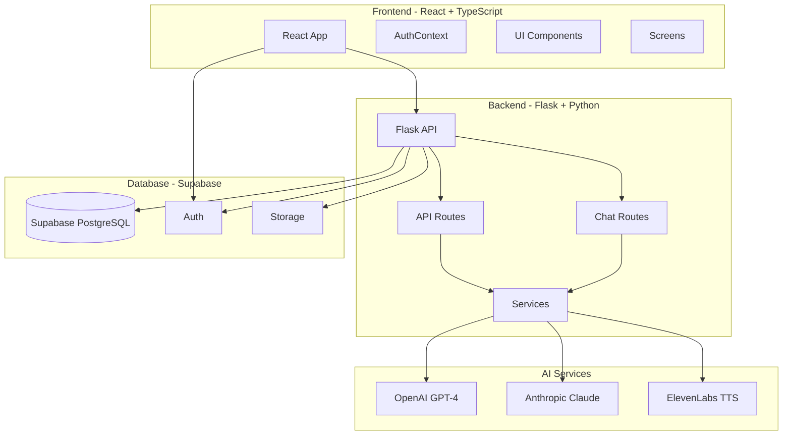
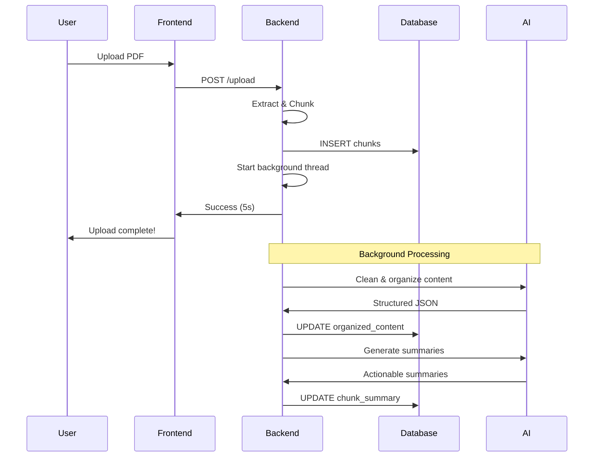

# MyRespondr

MyRespondr is a comprehensive emergency response management system designed
for schools and organizations. It provides real-time incident tracking,
AI-assisted decision support, and intelligent response plan management.

---

## Overview

MyRespondr transforms how organizations handle emergency situations by combining:

- **Real-time incident tracking** with multi-user collaboration
- **AI-powered assistance** using OpenAI GPT-4 and Anthropic Claude
- **Intelligent response plans** with automatic organization and deduplication
- **Role-based access control** for staff, administrators, and incident commanders
- **Voice assistance** for hands-free operation during emergencies
- **Comprehensive analytics** and incident logging

---

## Key Features

### Incident Management

- **Live incident tracking** with real-time updates
- **Phase-based workflows** (Preparation, Response, Recovery)
- **Multi-user collaboration** with role assignments
- **Status notifications** to stakeholders
- **Incident history** and analytics

### AI-Powered Assistance

- **Chat interface** with GPT-4/Claude for decision support
- **Context-aware responses** based on your response plans
- **Voice assistant** with text-to-speech capabilities
- **Actionable summaries** of response procedures
- **Group chat** for team collaboration during incidents

### Response Plan Management

- **PDF upload** of emergency response plans
- **AI-powered organization** removes duplicates and structures content
- **Background processing** for instant uploads and fast viewing
- **Interactive checklists** for action items
- **Phase-based navigation** with collapsible sections
- **Search and filter** capabilities

### Organization Management

- **Multi-organization support** with isolation
- **User management** with role-based permissions (Staff, Admin, Incident Commander)
- **Group management** for departments or teams
- **Subscription management** with feature gating

### Analytics & Reporting

- **Incident log** with filtering and search
- **Response evaluation** with AI-powered analysis
- **Lab reports** for testing response plans
- **Export capabilities** (PDF, DOCX)

### Security & Compliance

- **Supabase authentication** with email verification
- **Role-based access control** (RBAC)
- **Organization data isolation**
- **Secure API endpoints** with JWT tokens
- **CORS protection** and request validation

---

## Architecture



### Data Flow: Response Plan Processing



---

## Technology Stack

### Frontend

- **Framework:** React 18.2 with TypeScript
- **Build Tool:** Vite 5.0
- **Routing:** React Router DOM 6.30
- **UI Library:** Radix UI + Tailwind CSS 3.4
- **State Management:** React Context API
- **Styling:** Tailwind CSS with custom components
- **Utilities:**
  - `lucide-react` for icons
  - `react-markdown` for rendering
  - `dompurify` for sanitization
  - `html2canvas` + `jspdf` for exports

### Backend

- **Framework:** Flask 3.1
- **Language:** Python 3.11+
- **Package Manager:** uv (recommended) or pip
- **WSGI Server:** Gunicorn 23.0
- **Database:** Supabase (PostgreSQL)
- **Authentication:** Supabase Auth + PyJWT
- **Linter/Formatter:** Ruff (configured in pyproject.toml)
- **AI Services:**
  - OpenAI 1.88.0 (GPT-4, GPT-4o-mini)
  - Anthropic 0.18.1 (Claude)
  - ElevenLabs (Text-to-Speech)
- **Document Processing:**
  - PyMuPDF 1.26.3 (PDF extraction)
  - python-docx 1.2.0 (Word documents)
  - ReportLab 4.1.0 (PDF generation)
- **Utilities:**
  - Flask-CORS 6.0 (CORS handling)
  - Flask-Mail 0.9.1 (Email notifications)
  - Twilio 9.0+ (SMS notifications)
  - CacheTools 5.3+ (Response caching)

### Infrastructure

- **Database:** PostgreSQL (via Supabase)
- **Authentication:** Supabase Auth
- **Storage:** Supabase Storage
- **Deployment:**
  - Frontend: Render (Node.js 20.x)
  - Backend: Render (Python 3.11+)
- **Version Control:** Git

---

## AI Integration

### Response Plan Processing

**Automatic Background Processing:**
When a PDF is uploaded, two AI tasks run in the background:

1. **Content Organization** (GPT-4o-mini)
   - Removes duplicates
   - Structures content into sections/subsections
   - Categorizes items (bullets, paragraphs, checklists)
   - Stores in `organized_content` column

2. **Summary Generation** (GPT-4o-mini)
   - Creates actionable summaries
   - Identifies staff vs. commander roles
   - Stores in `chunk_summary` column

**Cost Efficiency:**

- Process once during upload (~$0.02-$0.05 per plan)
- Cache results in database
- View instantly ($0.00 per view)
- **98% cost reduction** vs. on-the-fly processing

**Technical Details:**

- Model: GPT-4o-mini
- Temperature: 0.2 (factual, consistent)
- Max tokens: 4000 per phase
- Processing time: ~1-3s per phase
- Background thread: Daemon, non-blocking

See [CurrentState.md](./CurrentState.md) for detailed architecture.

### Chat Assistance

**Available Models:**

- **OpenAI GPT-4** - Most capable, best for complex decisions
- **OpenAI GPT-4o-mini** - Fast and cost-effective
- **Anthropic Claude** - Alternative model with strong reasoning

**Context Integration:**

- Automatically includes relevant response plan sections
- Incident history and current status
- Organization-specific information
- Role-based recommendations

**Voice Assistant:**

- Text-to-Speech via ElevenLabs
- Hands-free operation during emergencies
- Customizable voice settings

---

---

## Getting Started

### Prerequisites

Before you begin, ensure you have the following installed:

- **Node.js** 20.x or higher
- **npm** 10.x or higher
- **Python** 3.11+ (for backend)
- **uv** (recommended) or **pip** (Python package manager)
- **Git** for version control

You'll also need accounts and API keys for:

- **Supabase** account (for database and authentication)
- **OpenAI** API key (for GPT-4 and GPT-4o-mini)
- **Anthropic** API key (optional, for Claude support)
- **ElevenLabs** API key (optional, for voice assistant)
- **Twilio** account (optional, for SMS notifications)

### Installation

#### 1. Clone the Repository

```bash
git clone https://github.com/your-org/MyRespondr.git
cd MyRespondr
```

### Environment Variables

Create a new file called `.env` at your project root. Copy the info from
[env.template](./backend/env.template) into this new file and fill it in with
your information

#### 2. Frontend Setup

```bash
# Navigate to frontend directory
cd frontend

# Install dependencies
npm install

# Start development server
npm run dev

# Frontend will be available at http://localhost:5173
```

#### 3. Backend Setup

**Option A: Using uv (Recommended - 10-100x faster)**

```bash
# Navigate to backend directory (from project root)
cd backend

# Install uv if you don't have it
curl -LsSf https://astral.sh/uv/install.sh | sh  # macOS/Linux
# Or on Windows: powershell -c "irm https://astral.sh/uv/install.ps1 | iex"

# Install dependencies (uv manages virtual environment automatically)
uv sync

# Troubleshooting: If `uv sync` fails with "No `pyproject.toml` found" or similar,
# either run `uv` from the project root where `pyproject.toml` exists (if your project
# uses one) or use the traditional venv/pip flow in Option B (see below). A minimal
# alternative is to install deps with `pip install -r requirements.txt` and run
# `python app.py`.

# Start Flask development server
uv run python app.py

# Backend will be available at http://localhost:5000
```

**Option B: Traditional pip/venv**

```bash
# Navigate to backend directory (from project root)
cd backend

# Create virtual environment
python -m venv venv

# Activate virtual environment
# On Linux/Mac:
source venv/bin/activate
# On Windows:
venv\Scripts\activate

# Install dependencies
pip install -r requirements.txt

# Start Flask development server
python app.py

# Backend will be available at http://localhost:5000
```

#### 4. Database Setup

The database tables will be automatically created when you first start the backend server. The `setup_database()` function runs automatically on startup.

To manually verify or re-run database setup:

```bash
cd backend

# With uv
uv run python -c "from database.setup_database import setup_database; setup_database()"

# With traditional venv
python -c "from database.setup_database import setup_database; setup_database()"
```

### Verification

#### Test Frontend

1. Open browser to `http://localhost:5173`
2. You should see the MyRespondr landing page
3. Try creating an account or logging in

#### Test Backend

```bash
# Health check
curl http://localhost:5000/api/health

# Expected response:
# {"status":"healthy","message":"API is working","cors":"enabled"}

# Test CORS
curl http://localhost:5000/api/test-cors

# View all available routes
curl http://localhost:5000/api/routes
```

#### Test Database Connection

```bash
cd backend
python -c "from database.supabase_helper.supabase_client import get_supabase_client; client = get_supabase_client(); print('✅ Database connected!' if client else '❌ Connection failed')"
```

### First-Time Setup Checklist

- [ ] Install Node.js 20.x and npm 10.x
- [ ] Install Python 3.11+
- [ ] Install uv (recommended) or ensure pip is available
- [ ] Create Supabase project and get credentials
- [ ] Get OpenAI API key
- [ ] Create frontend `.env` file with Supabase credentials
- [ ] Create backend `.env` file with all required keys
- [ ] Install frontend dependencies (`npm install`)
- [ ] Install backend dependencies (`uv sync` or `pip install -r requirements.txt`)
- [ ] Start backend server and verify database setup
- [ ] Start frontend server
- [ ] Create test account and verify login
- [ ] Upload a test response plan PDF
- [ ] Verify AI chat functionality

### Common Setup Issues

#### Issue: Frontend can't connect to backend

**Solution:**

- Ensure backend is running on `http://localhost:5000`
- Check `VITE_API_URL` in frontend `.env`
- Verify CORS settings in backend `.env` (`ALLOWED_ORIGINS`)

#### Issue: Database connection fails

**Solution:**

- Verify `SUPABASE_URL` and `SUPABASE_KEY` are correct
- Use the **service role key** (not anon key) in backend
- Check Supabase project is active and accessible

#### Issue: AI features not working

**Solution:**

- Verify `OPENAI_API_KEY` is set in backend `.env`
- Check API key has sufficient credits
- Review backend console for API error messages

#### Issue: Background processing not completing

**Solution:**

- Check backend console logs for errors
- Verify OpenAI API key is valid
- Ensure database has `organized_content` column in `OrganizationPlansParsed` table
- Look for logs starting with `🧹` and `📊`

#### Issue: Email verification not sending

**Solution:**

- Verify Flask-Mail environment variables are correct
- Use an app-specific password (not your regular Gmail password)
- Check Supabase email settings are configured

### Quick Start Commands

```bash
# Start everything (requires two terminal windows)

# Terminal 1: Backend (with uv - recommended)
cd backend
uv run python app.py

# OR Terminal 1: Backend (with traditional venv)
cd backend
source venv/bin/activate  # or venv\Scripts\activate on Windows
python app.py

# Terminal 2: Frontend
cd frontend
npm run dev

# Navigate to http://localhost:5173
```

### Next Steps

After successful setup:

1. **Create your organization** - Sign up and create your first organization
2. **Invite staff members** - Add team members with appropriate roles
3. **Upload response plans** - Upload your emergency response plan PDFs
4. **Test the chat** - Try the AI chat assistant with your plans
5. **Create test incident** - Practice incident tracking workflow
6. **Explore features** - Familiarize yourself with all modules

For detailed documentation, see:

- [CurrentState.md](./CurrentState.md) - System architecture
- [TEST_UPLOAD_INSTRUCTIONS.md](./TEST_UPLOAD_INSTRUCTIONS.md) - Testing guide
- `backend/docs/` - Backend-specific documentation
- `frontend/src/screens/*/README.md` - Component documentation

---

## Development

### Code Style

**Frontend:**

- TypeScript strict mode
- Functional components with hooks
- Tailwind CSS for styling
- Component composition over inheritance

**Backend:**

- PEP 8 style guide (enforced with Ruff)
- Type hints where applicable (prefer `dict | None` over `Optional`)
- Service layer pattern
- Blueprint-based routing
- Format code: `uv run ruff format .`
- Check linting: `uv run ruff check . --fix`

### Testing

#### Frontend Testing

```bash
cd frontend
npm run build    # Verify build
npm run preview  # Preview production build
```

#### Backend Testing

```bash
cd backend

# With uv
uv run pytest                          # Run tests
uv run python app.py                   # Manual testing
curl http://localhost:5000/api/health  # Health check

# With traditional venv
python -m pytest                       # Run tests
python app.py                          # Manual testing
curl http://localhost:5000/api/health  # Health check
```

---

## Contributing

### Workflow

1. **Create a feature branch**

   ```bash
   git checkout -b feature/your-feature-name
   ```

2. **Make changes and test**

   ```bash
   # Frontend
   cd frontend && npm run build

   # Backend (with uv)
   cd backend && uv run python app.py
   ```

3. **Format and lint your code**

   ```bash
   # Backend - Format with Ruff
   cd backend
   uv run ruff format .
   uv run ruff check . --fix ## Optional

   # Frontend - Format with Prettier and ESLint
   cd frontend
   npm run format
   npm run lint:fix ## Optional
   ```

4. **Commit with clear messages**

   ```bash
   git add .
   git commit -m "feat: add new incident notification system"
   ```

5. **Push and create PR**

   ```bash
   git push origin feature/your-feature-name
   ```

   **Note**: GitHub Actions will automatically check formatting and linting.
   Make sure to run the formatting commands before pushing to avoid CI failures.

### Commit Convention

- `feat:` New feature
- `fix:` Bug fix
- `docs:` Documentation changes
- `style:` Code style changes (formatting)
- `refactor:` Code refactoring
- `test:` Test additions or changes
- `chore:` Build process or tooling changes

---

## License

**Proprietary** - All rights reserved.

This software is proprietary and confidential. Unauthorized copying, modification,
distribution, or use of this software, via any medium, is strictly prohibited.

---
